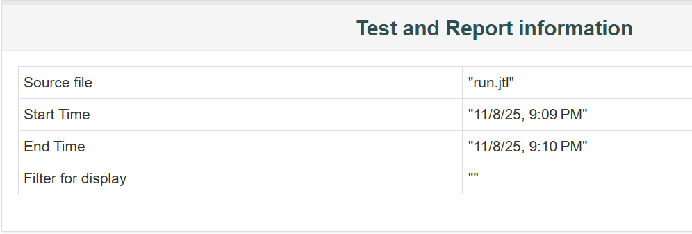
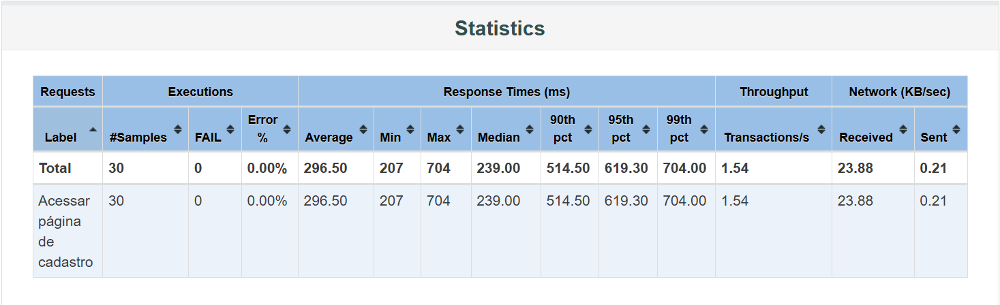
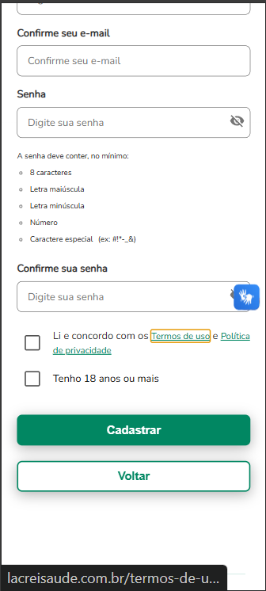
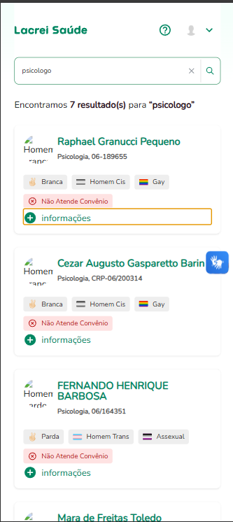
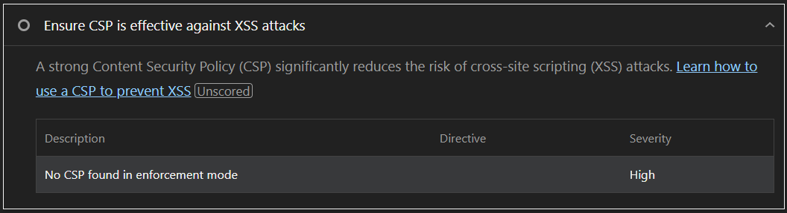

# 🧪 Desafio Técnico QA - Lacrei Saúde

Repositório contendo testes da plataforma Lacrei Saúde com: testes funcionais (Gherkin), automação (Cypress + Cucumber),performance, acessibilidade, responsividade, checklist de segurança, documentação e relatórios.

## 📁 Link para o Notion:

- url: "https://complex-barberry-25f.notion.site/ebd/2a20ff41317e804e89d6ea07fcfab075"

📄 Como este projeto está organizado:

## 💻 Execução Manual em Mobile (Android - DevTools)

<details>
<summary>📱 <b>Fluxo: Cadastro da pessoa usuária (clicar para expandir)</b></summary>

Ambiente:
- Dispositivo simulado: samsung Galaxy S20 Ultra
- Navegador: Google Chrome DevTools (versão 142)
- User Agent: Mozilla/5.0 (Linux; Android 12; Pixel 5) AppleWebKit/537.36 (KHTML, like Gecko) Chrome/121.0 Mobile Safari/537.36
- Viewport: 412 × 915 px
- Execução: manual com base nos cenários Gherkin (`tests/manual/features/cadastro.feature`)
- Evidências: armazenadas em `tests/manual/evidence/cadastro`

Validações realizadas (cenário positivo Cadastro completo e primeira busca):

📄Preenchimento dos campos
 - Cadastro - sucesso
 - Login - sucesso
 - Pós-cadastro - sucesso
 - Pesquisar profissional - sucesso

🔁Redirecionamentos
 - Redirecionamento tela de 'login' - bug
 - Redirecionamento tela 'pós-cadastro' - bug
 - Redirecionamento tela 'pesquisar profissional' - sucesso

💬Mensagens de feedback para o usuário
 - "Cadastro realizado com sucesso" - melhoria
 - "E-mail de confirmação de cadastro enviado. Por favor, verifique sua caixa de entrada" - melhoria

Validações realizadas (cenário negativo Cadastro com e-mail já cadastrado):

📄Preenchimento dos campos
 - Cadastro - sucesso

💬Mensagens de feedback para o usuário 
- "E-mail já cadastrado" - bug

🐞Bug fora do fluxo encontrado
- Foto do profissional não é exibida corretamente - bug

</details>

<details>
<summary>📱 <b>Fluxo: Buscar e contatar profissional (clicar para expandir)</b></summary>

Ambiente:
- Dispositivo simulado: samsung Galaxy S20 Ultra
- Navegador: Google Chrome DevTools (versão 142)
- User Agent: Mozilla/5.0 (Linux; Android 12; Pixel 5) AppleWebKit/537.36 (KHTML, like Gecko) Chrome/121.0 Mobile Safari/537.36
- Viewport: 412 × 915 px
- Execução: manual com base nos cenários Gherkin (`tests/manual/features/busca-profissional.feature`)
- Evidências: armazenadas em `tests/manual/evidence/busca-profissional`

Validações realizadas (cenário positivo Buscar profissional e entrar em contato):

📄Preenchimento dos campos
 - Busca - sucesso
 - Celular - sucesso
 - Código - bug

🔁Redirecionamentos
 - Redirecionamento lista de profissionais disponíveis - sucesso
 - Redirecionamento página do profissional - sucesso
 - Redirecionamento página exibir contato - sucesso
 - Redirecionamento página para entrar em contato com profissional - bloqueado

💬Mensagens de feedback para o usuário
 - "Código enviado para o número informado" - melhoria

Validações realizadas (cenário negativo Preencher campo código com código inválido):

📄Preenchimento dos campos
 - Código de verificação - bug

💬Mensagens de feedback para o usuário 
- "Código inválido! Tente novamente" - bloqueado

</details>

<details>
<summary>📱 <b>Fluxo: Edicão de perfil (clicar para expandir)</b></summary>

Ambiente:
- Dispositivo simulado: samsung Galaxy S20 Ultra
- Navegador: Google Chrome DevTools (versão 142)
- User Agent: Mozilla/5.0 (Linux; Android 12; Pixel 5) AppleWebKit/537.36 (KHTML, like Gecko) Chrome/121.0 Mobile Safari/537.36
- Viewport: 412 × 915 px
- Execução: manual com base nos cenários Gherkin (`tests/manual/features/edicao-perfil.feature`)
- Evidências: armazenadas em `tests/manual/evidence/edicao-perfil`

Validações realizadas (cenário positivo Atualizar informações de perfil):

📄Preenchimento dos campos
 - Tela "Editar dados" - sucesso

🔁Redirecionamentos e atualizações
 - Redirecionamento Tela editar dados - sucesso
 - Redirecionamento Tela "Perfil" após editar dados - sucesso
 - Visulização dos dados atualizados - sucesso

💬Mensagens de feedback para o usuário
 - sem mensagem "Dados atualizados com sucesso" - melhoria

 Validações realizadas (cenário positivo Atualizar foto de perfil):

 📄Preenchimento dos campos
 - Campo descrição da foto - bug

🔁Redirecionamentos e carregamento
 - Redirecionamento do botão "editar foto" - sucesso
 - Carregamento de imagem ao clicar em "enviar foto" - sucesso
 - Botão de "salvar" - sucesso

💬Mensagens de feedback para o usuário
 - "Erro ao salvar a foto" - bug

Validações realizadas (cenário negativo Preencher campo "Nome civil ou social" vazio):

📄Preenchimento dos campos
 - Campo "Nome civil ou sicial" vazio- sucesso

💬Mensagens de feedback para o usuário 
- "Nome deve ser preenchido" - sucesso

</details>

<details>
<summary>📱 <b>Fluxo: Recuperação de senha (clicar para expandir)</b></summary>

Ambiente:
- Dispositivo simulado: samsung Galaxy S20 Ultra
- Navegador: Google Chrome DevTools (versão 142)
- User Agent: Mozilla/5.0 (Linux; Android 12; Pixel 5) AppleWebKit/537.36 (KHTML, like Gecko) Chrome/121.0 Mobile Safari/537.36
- Viewport: 412 × 915 px
- Execução: manual com base nos cenários Gherkin (`tests/manual/features/recuperacao-senha.feature`)
- Evidências: armazenadas em `tests/manual/evidence/recuperacao-senha`

Validações realizadas (cenário positivo Recuperação bem-sucedida):

📄Preenchimento dos campos
 - Campo "Digite seu e-mail" - sucesso

🔁Redirecionamentos e atualizações
 - Redirecionamento Tela "enviar link" - sucesso
 - Recebimento do e-mail de recuperação - sucesso
 - Redirecionamento botão "redefinir senha" - blocked

💬Mensagens de feedback para o usuário
 - "Verifique seu e-mail para redefinir a senha" - sucesso

Validações realizadas (cenário negativo E-mail não cadastrado):

📄Preenchimento dos campos
 - Campo "Digite seu e-mail"- sucesso

💬Mensagens de feedback para o usuário 
- "Algo deu errado, por favor, confira os dados inseridos e tente novamente" - sucesso

</details>

## 🚀 Automação e CI/CD

<details>
<summary>📱 <b>Clicar para expandir</b></summary>

### ⚙️ Configuração do ambiente
**Requisitos:**
- Node.js v20+
- Cypress v15.6.0
- TypeScript
- Dependências instaladas:
  ```bash
  npm install
  ```
### Casos de testes organizados na pasta:
tests/automation/cypress/cucumber/cadastro.feature

---

### 🧩 Execução local dos testes automatizados
Os testes utilizam **Cypress + Cucumber** com sintaxe Gherkin (`.feature`) para automação E2E do fluxo de **cadastro completo e primeira busca**.

**Rodar o teste específico:**
```bash
npx cypress run --spec "tests/automation/cypress/cucumber/cadastro.feature"
```

**Abrir o modo interativo (visual):**
```bash
npx cypress open
```

> Recomendado: no modo interativo, selecione o navegador **Electron** (padrão) e clique na spec `cadastro.feature` para executar o fluxo completo.

---

### 🧾 Geração de relatórios
Os relatórios são gerados automaticamente pelo **Mochawesome Reporter**.

**Configuração usada (`cypress.config.ts`):**
```ts
reporter: "cypress-mochawesome-reporter",
reporterOptions: {
  reportDir: "tests/automation/reports",
  overwrite: false,
  html: true,
  json: true
}
```

**Complemento no arquivo `e2e.ts`:**
```ts
import "cypress-mochawesome-reporter/register";
```

**Saída esperada:**
- Relatórios: `tests/automation/reports/*.html`
- Screenshots: `cypress/screenshots/`

---

### 🤖 Execução automática via GitHub Actions
Os testes são executados automaticamente a cada **push** ou **pull request** para a branch `main`.

**Pipeline:** `.github/workflows/ci-e2e.yml`
```yaml
name: e2e-tests

on:
  push:
    branches: [main]
  pull_request:
    branches: [main]

jobs:
  cypress-run:
    runs-on: ubuntu-latest
    steps:
      - name: Checkout repository
        uses: actions/checkout@v4

      - name: Setup Node.js
        uses: actions/setup-node@v4
        with:
          node-version: 20

      - name: Install dependencies
        run: npm ci

      - name: Run Cypress tests
        run: npx cypress run --spec "tests/automation/cypress/cucumber/cadastro.feature"

      - name: Save Cypress reports and videos
        uses: actions/upload-artifact@v4
        with:
          name: cypress-artifacts
          path: |
            tests/automation/reports/**
            cypress/videos/**
            cypress/screenshots/**
```

</details>

## 🚀 Testes de Desempenho (Performance)

<details>
<summary>📱 <b>Tempo de resposta (clicar para expandir)</b></summary>

- **Cenário de teste**: `tests/performance/performance.feature
- **URL testada**: https://paciente.lacreisaude.com.br/cadastro
- **URL testada**: https://paciente.lacreisaude.com.br/buscar-profissional/
- **Ferramenta**: Lighthouse CI (mobile)
- **Screenshots das evidências**: `tests/performance/evidence`

- **Tela Cadastro**
  - First Contentful Paint: **1.0s** ✅
  - Largest Contentful Paint: **4.2s** ⚠️ (abaixo da meta de 2.5s)
  - Speed Index: **3.0s** ✅
  - **Notas**:
  - Página apresenta bom tempo de resposta inicial, mas o carregamento do maior conteúdo (imagem/texto principal) ainda pode ser otimizado.
  - Relatório completo em: `.lighthouseci/report_cadastro.html`

- **Tela Busca Profissional**
  - First Contentful Paint:** **0.9s** ✅  
  - Largest Contentful Paint:** **5.5s** ⚠️ (acima da meta de 2.5s)  
  - Total Blocking Time:** **340ms** ⚠️ (dentro do limite aceitável, mas pode ser otimizado)  
  - Speed Index:** **3.0s** ✅  
  - Cumulative Layout Shift:** **0.005** ✅ (excelente estabilidade visual)  
  - Score de Performance:** **71/100**
  - **Notas**:
  - O carregamento inicial é rápido e estável, com FCP inferior a 1 segundo.
  - O principal gargalo está no **Largest Contentful Paint (LCP)** de 5,5s — causado principalmente por imagens grandes e scripts não otimizados.
  - Relatório completo em: `.lighthouseci/report_busca_profissional.html`

  </details>

<details>
<summary>📱 <b>Teste de carga - Tela Cadastro (clicar para expandir)</b></summary>

O teste foi realizado com o [Apache JMeter](https://jmeter.apache.org/) simulando **30 usuários simultâneos** acessando o fluxo de cadastro no ambiente `https://paciente.lacreisaude.com.br/cadastro/`.

### 📌 Configuração do teste

- 🔁 **Usuários simultâneos:** 30 threads
- ⏱ **Ramp-up:** 20 segundos
- 🔄 **Execuções por usuário:** 1 iteração
- 📍 **Cenário:** Preenchimento e envio do formulário de cadastro

### 📊 Resultados principais

| Métrica                    | Valor médio(ms)   | Valor máximo(ms)  | Observações                         |
|---------------------------|---------------|---------------|-------------------------------------|
| ⏱ Tempo de resposta médio | `296.50`      | `704`    | Dentro do limite aceitável          |
| ✅ Sucesso nas requisições | `100%`        | —             | Nenhuma falha identificada          |
| 📉 Erros                  | `0`           | —             | Todas as requisições válidas        |

### 📂 Evidência visual

<p align="center">
  
</p>

<p align="center">
  
</p>

</details>

## 🚀 Testes de Acessibilidade

<details>
<summary>📱 <b>Relatório - Testes com DevTools, Lighthouse e NVDA (clicar para expandir)</b></summary>

### Checklist de Validações:

| Validações | cadastro | profissionais | login | perfil |
|------------|----------|---------------|-------|--------|
| foco visível (ex: borda, sombra) | OK | OK | OK | OK |
| ordem de navegação | OK | OK | OK | OK |
| nenhum elemento essencial fica inacessível | NOK | NOK | OK | OK |
| Labels de inputs são lidos corretamente | Parcial | Parcial | Parcial | Parcial |
| Score ≥ 90 | 100% | 100% | 100% | 100% |

### Evidências:

- Durante o teste foi percebido que navegando pela a tecla Tab não é possível selecionar os botões 'termos de uso' e 'Tenho 18 anos ou mais'

<p align="center">
  
</p>

- Durante o teste na lista de profissionais, foi percebido que navegando pela tecla Tab não é possível
ser redirecionado ao clicar em '+ informações'

<p align="center">
  
</p>

</details>

## 🚀 Testes de Responsividade

<details>
<summary>📱 <b>Relatório - Testes com DevTools + Lighthouse (clicar para expandir)</b></summary>

- **Cenário de teste**: `tests/responsividade/responsividade.feature

### Ambiente:

- Navegador: Google Chrome DevTools (versão 142)
- User Agent: Mozilla/5.0 (Linux; Android 12; Pixel 5) AppleWebKit/537.36 (KHTML, like Gecko) Chrome/121.0 Mobile Safari/537.36
- Mobile: samsung Galaxy S20 Ultra
- Viewport: 412 × 915 px
- Desktop: Windows
- Viewport: 1440 × 900 px

### Telas validadas:
- Mobile: Tela de cadastro
- Desktop: Busca profissional

### Checklist de Validações:

| Validações | mobile| desktop |
|------------|-------|---------|
| Layout | OK | OK |
| Funcionalidade | OK | OK |
| Usabilidade | OK | OK |

</details>

## 🔐 Checklist de Segurança

- [x] Uso de HTTPS em todas as rotas
- [x] Inputs de senha mascarados
- [ ] Prevenção básica contra XSS
- [x] Mensagens de erro não expõem informações sensíveis
- [x] Sem exposição de tokens ou senhas na UI ou responses

### Evidências:

- Ao executar o Lighthouse foi observado que o aplicativo falhou em um dos critérios de segurança

<p align="center">
  
</p>


